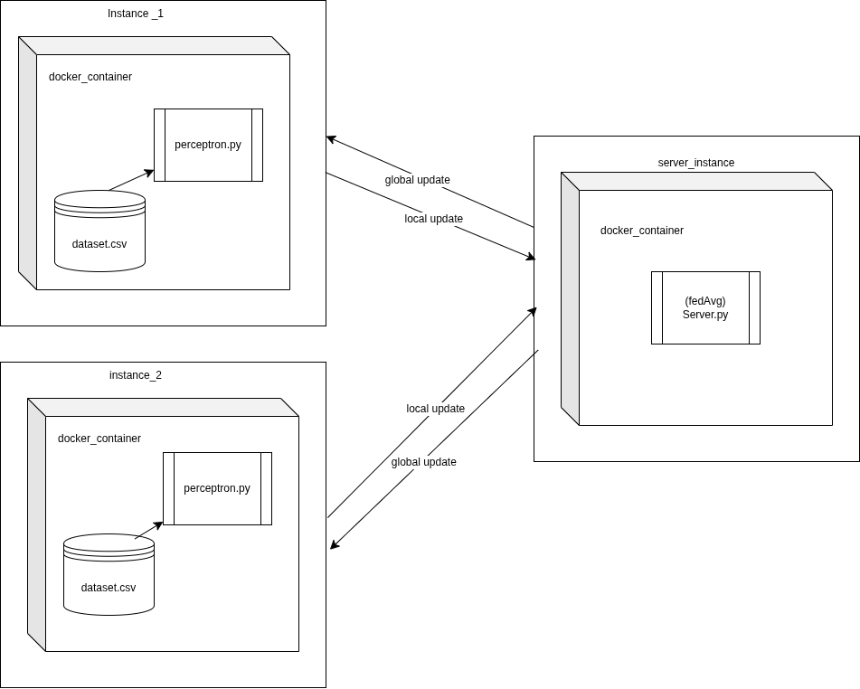

# Federated learning presentation code working demo 

#### install prerequisites python 
```python
pip install flwr
pip install numpy
pip install pandas
```

 you dont need to install it check requirement.txt -> auto installation while setting up docker container 

setting up environment 

#### install prerequisites
```bash
python 3.8 + , newer version required 
docker , docker-compose 
prefered linux/unix based system 
```

#### Containerized architecture federeated learning using docker 


#### file structure 
```python
create folder fed_learn_test
change directory fed_learn_test
inside folders create 
 -create folders
   -> device_1
       -create files
        ->Dockerfile
	    ->perceptron_code_1.py
		->requirement.txt
		->spam1.csv
   -> device_2
       -create files
        ->Dockerfile
	    ->perceptron_code_2.py
		->requirement.txt
		->spam2.csv
   -> server
 -create files
    ->docker-compose.yml
	->requirements.txt
```


#### Running the code 
#### clone the repository
make sure git is installed in your system 
after cloning the repo check all the files are similar to our structure
```console
-> git clone https://github.com/sidhuag23/federated_learning- 
-> cd fed_learn_test
-> docker compose build --no-cache
-> docker compose up
```

#### if need to re-run
```console
-> cd fed_learn_test
-> docker compose up
```
 
####  re-download and re-run
```console
-> cd fed_learn_test
-> docker compose down 
-> docker compose buid --no-cache
-> docker compose up

```
 
